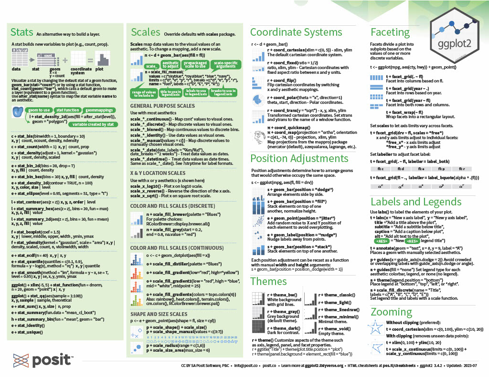

```{r setup, include=FALSE}
knitr::opts_chunk$set(echo = TRUE)
library(tidyverse)
getwd()
```

#### Topic 1: Basics - setting your working directory, install and calling packages  

**Setting your working directory:**  
This step is really important and tells R where you're grabbing files from on your computer. There are a couple options for setting your working directory:  

* set it manually using the `setwd()` command
    + Ex: setwd("~/User/Dawg1/Documents")  
* set it to the source file location  
    + If your script is saved in the same location as the files you will be loading, you can go to the session menu, select "Set working directory" and then select "To source file location"
* set it to a folder you browse for  
    + You can select your working directory location by going to the session menu, selecting "Set working directory" and then selecting "Choose directory"  

**Installing a package:**   
We've used a few packages in this class so far (one example is tidyverse). As you work more with R, you may find more and more useful packages. If you don't have a package on your computer, you'll have to install it using `install.packages()`. Make sure you put the name of the package in quotes when you're using `install.packages()`  

**Calling a package from your library:**    
If you have a package installed, it's in your library, but will not be automatically loaded when you start a new R session. To use the functions in that package, you'll need to call it from your library.  
For example, if we want to use `ggplot()`, we'll need to call tidyverse using the `library()` command.  
Example: `library(tidyverse)` 

Side note: You could also use library(ggplot2) if you were just using ggplot functions. tidyverse is a bit of a super package that contains a lot of other packages (including ggplot2).  

#### Topic 2: Reading in data and viewing it  
Often times we'll read things in as .csv files using `read.csv`  

For the bears problem set, we used the following code:  
```{r,evaluate=FALSE}
bears<- read.csv("PS1_Data_Bears.csv")
```

**Viewing the data frame:**  

To view the bears data frame, there are a couple options:   

* You can type `View(bears)` into the console or into your script  
* You can click on bears in the global environment  

Some options for looking at your data:   

* Overview of the entire data frame:
    + `str()` gives an overview of the length, column names, and the type of data (number, character, integer, etc.) in each column  
    + `head()` gives the first six rows of your data frame  
    + `summary()` gives a summary of each column in your data frame (quantiles, minimums, maximums)  
* For specific columns - remember to use the $ operator to specify the column!  
    + `sum()` the total in a column  
    + `min()` `mean()` `median()` and `max()` for those summary stats  

**Subsetting the data frame:**  

The brackets method from the bears problem set:  
```{r,eval=FALSE}
#getting a single column, females
bears[,2] #second column
bears$females #equivalent 

#making two data frames for data before and after 1976
bears1 <- bears[bears$year<1977,]
bears2 <- bears[bears$year>1975,]
```

Tidyverse options:  
```{r,eval=FALSE}
#load tidyverse
library(tidyverse)

#getting a single column
bears %>% select(females)

#subsetting before and after 1976
bears1 <- bears %>% filter(year<1977)
bears2 <- bears %>% filter(year>1975)
```

#### Topic 3: Plotting  
Example from the bears problem set:  
```{r}
plot(bears$year,
     bears$females,
     xlab="Year",
     ylab="Number of females", 
     col="forestgreen", 
     type="o", 
     pch=20)

# a tidyverse option: 
ggplot(bears,aes(x=year,y=females)) +
  geom_point() +
  geom_line() +
  xlab("Year") +
  ylab("Number of females") +
  theme_classic()
```

**Commands for more advanced plotting in ggplot**  

ggplot cheat sheet page 1:    

ggplot cheat sheet page 2:   


#### Topic 4: Calculating different response variables  

In problem set 2, we calculated lambda for the terns on all of the islands using a for loop:

```{r}
terns <- read.csv("PS2_data_terns.csv")

#calculate the total terns by adding together the terns from each island
terns$total <- terns$bird + terns$ram + terns$pikense

#create an empty column for the growth rate to populate
terns$total_growth_rate <- NA

for(i in 2:length(terns$year)){ # initiate the loop with "for"
  terns$total_growth_rate[i] <- terns$total[i]/terns$total[i-1] 
  # calculate the growth rate as the ratio between population size now and population size one year ago
  } # close the loop
```

We could have also done this calculation using the `lag()` command in the package `dplyr`. `dplyr` is another package in tidyverse. `lag()` can be used to create column that is one row behind the column we input. 

```{r}
terns$total_N0 <- lag(terns$total) #lag function makes a new column with total column shifted down a row (lag=1)

#calculate lambda by dividing total at N+1 by total at N
terns$lambda <- terns$total / terns$total_N0
```

If we compare the two lambas we calculated, total_growth rate using a loop and lambda using lag, we can see they lead to the same result:  
```{r,warning=FALSE}
ggplot(terns,aes(x=total,y=total_growth_rate)) +
  geom_point() + theme_classic()

ggplot(terns,aes(x=total,y=lambda)) +
  geom_point() +theme_classic()
```

In the tern example, we also fit a line to these data. In base r, we used `abline()` and `lm()` (linear model). We can do the same in ggplot using  `geom_smooth()`
```{r,warning=FALSE}
#base r
plot(terns$total, terns$total_growth_rate)
abline(lm(total_growth_rate~total, data=terns))

#tidyverse option
ggplot(terns,aes(x=total,y=lambda)) +
  geom_point() +
  geom_smooth(method='lm',se=F) + #se=F here means it will just show the line and not an estimate of the error associated with the fit
  theme_classic()
```


#### Topic 5: Working with the SRS zooplankton data  
We often want to know how many of a certain thing we have. For one of the problem sets, we calculated the number of unique taxa using `length()` and `unique()`  
```{r}
zoop <- read.csv("SRS_zoop.csv")
#number of different taxa 
length(unique(zoop$taxa))

#number of bays
length(unique(zoop$bay))
```
From this, we see that there are 133 different taxa found in the 14 different bays.  

We may want to ask about unique taxa in each bay. We could subset and create data frames for each of the bays like we did for the bears data or we could create a loop, but we can also use tidyverse syntax and the `group_by()` and `summarize()` commands. Within summarize, we're using `n_distinct()` which counts the number of distinct observations in the specified column.  
```{r}
zoop %>% group_by(bay) %>%
  summarize(unique_taxa = n_distinct(taxa))
```

**Other loop and tidyverse equivalent processes from working with these data in the problem sets:**  

In the problem set, we calculated abundance of each of the taxa using this code: 
```{r}
taxa <- unique(zoop$taxa) # first step is to create a list of all taxa
total.abundance <- data.frame(taxa=taxa) # then create an empty dataframe
# that just includes the names of the taxa. then, we'll fill in a second
# column of the dataframe with our loop:
for(i in 1:length(taxa)){
  zoop.subset <- zoop[zoop$taxa==taxa[i],] # subset the data to only include
  # rows where taxa i is observed. 
  total.abundance$abundance[i] <- sum(zoop.subset$abund, na.rm=T)
  # sum up the total abundance of that taxa, after removing NAs
  # and input it as the i'ith observation in the summary dataframe
}

#we can use head to see the first six rows of our sorted abundance data frame
head(total.abundance[order(total.abundance$abundance),])

#adding a minus sign in front of the column we want to sort using order sorts it the opposite direction (descending)
head(total.abundance[order(-total.abundance$abundance),])
```
There's also an option to do the same thing in tidyverse. In this example, we group the data by taxa and then summarize each of those groups by summing abundance. We can then compare the first and last six values we get from this method.  
```{r}
total_abundance<-zoop %>% group_by(taxa) %>%
  summarize(abundance=sum(abund,na.rm=T))

# to sort using pipes, we use arrange and then head to get the first 6 rows of that arrange data
total_abundance %>% arrange(abundance) %>% head()

# to sort so abundance is descending, we use arrange with desc (for descending)
total_abundance %>% arrange(desc(abundance)) %>% head()
```
We also calculated occupancy of each of the bays for *Bosmina tubicen*. We did this with a for loop:
```{r}
bays <- unique(zoop$bay) # first we need to create a list of the bays
bay.occupancy <- data.frame(bay=bays) # next we create an empty summary 
# dataframe

#in this loop, we loop through each of the bays
for(i in 1:length(bays)){
  zoop.subset <- zoop[zoop$bay==bays[i],] # subset the dataset so we are
  # only looking at the i'ith bay
  bos.subset <- zoop.subset[zoop.subset$taxa=="Bosmina tubicen",]
  # subset data from the i'ith bay to only include observations of bosmina
  bay.occupancy$bos[i] <- ifelse(sum(bos.subset$abund, na.rm=T) > 0, 1,0)
  # use the ifelse statement to say, if abundance is greater than 0, input
  # a 1 into the summary spreadsheet. otherwise (else) input a 0. 
}

# remember we define occupancy in metapopulation theory as the fraction of 
# sites that are occupied. so we need to divide the total number of sites
# where bosmina was present by the number of bays:
sum(bay.occupancy$bos)/length(bays)
```

We can do this using tidyverse too. 
```{r}
bay_occupancy <- zoop %>% group_by(bay) %>%                 #we group by bay
  mutate(bos = str_detect(taxa, 'Bosmina tubicen')) %>%     #add a column that is true or false depending on if bosmina is in the taxa list
  summarize(bos_present = ifelse(any(bos==TRUE),1,0))       #and then summarize using ifelse to get a list of the bays with 1 or 0 based on if the column we added has any bosmina tubicen observations in it

#we can calculate occupancy just like we did with the base r method
sum(bay_occupancy$bos_present/length(bays))
```


#### Topic 6: Tidy versions of problem set 7:   

In problem set 7, we calculated various diversity indices with the zoop dataset:  
```{r}
#look at just bay 80 by creating a subsetted data frame called bay80
bay80 <- zoop[zoop$bay==80,] 

#now subset that data frame to one sampling date
bay80s41410 <- bay80[bay80$sample_date=="4/14/10",]

# for richness, we just need to know the number of unique species. 
length(unique(bay80s41410$taxa))

# for simpson's & shannon's diversity, we first need to convert all species abundances
# into frequencies. the first step is to figure out the denominator; i.e., the total
# number of 'things' counted. for that, we'll use the sum function.
total.counted <- sum(bay80s41410$abund)

# next, we'll create a new column in the subset dataframe where we calculate the 
# frequencies for each species
bay80s41410$freq <- bay80s41410$abund / total.counted
# now, for simpson's diversity, we would need to square each one...
bay80s41410$freq_sq <- bay80s41410$freq^2
# and then sum them up, and divide from 1:
simp_bay80s41410 <- 1 / sum(bay80s41410$freq^2)
simp_bay80s41410
```

If we want to do that same thing using tidyverse, we can do the same steps, but pipe them through. One benefit of using pipes is that we can start with the main zoop data frame each time and not name new objects. This reduces 'clutter' in your global environment.  
```{r}
#first, calculating richness
zoop %>% 
  filter(bay=="80"&sample_date=="4/14/10") %>% #filter to the bay and sampling date
  select(taxa) %>%  #select just the taxa column
  summarize(richness=n_distinct(taxa))  #summarize the column and find the distinct entries (the number of different taxa)

#now, calculating simpson's diversity
zoop %>% 
  filter(bay=="80"&sample_date=="4/14/10") %>%
  mutate(total_counted = sum(abund),
         freq = abund/total_counted,
         frequency_sq = freq^2) %>%
  summarize(simpsons_div = 1/sum(frequency_sq))
  
```

Now a bonus: the end of problem set 7 included a loop to find richness of all the sames in bay 80.

```{r}
sampls <- unique(bay80$sample) # a list of the samples; this is what we'll loop through
rich.summary <- data.frame(sample_date = sampls) #create summary dataframe, to be filled in row by row

for (i in 1:length(sampls)){ # for each one of the samples,
  sub80 <- bay80[bay80$sample==sampls[i],] # create a subset of the data for that sample
  rich.summary$rich[i] <- length(unique(na.omit(sub80$taxa))) # calculate richness and fill it it
  # fill it in on the summary dataframe. notice the 'na.omit'... that's because I want a sample
  # with only NA's to have a richness of 0, not 1.
  }
rich.summary # you can check the summary here. 
```

I'm sure you've guessed this by now, but we can also do the same thing using tidyverse syntax.
```{r}
bay80_richness <- zoop %>% 
  filter(bay == "80") %>%
  group_by(sample_date) %>%
  summarize(richness = n_distinct(taxa,na.rm=T))
bay80_richness
```

If you want to convince yourself that these two methods output the same results, we can merge the two outputs together and compare the richness we calculated for each sample date. Merging, using the `merge()` command, is a useful skill to know and is helpful if you're bringing together multiple data sources.  
```{r}
#here's how we would merge the two outputs together
#the arguements we need are the two data frames we're merging and what column they have in common
merge(bay80_richness,rich.summary,by="sample_date")
```

**A last example of one of the benefits of using pipes in tidyverse:**   

We haven't run into this much in our problem sets, but one of the disadvantages of using some of the base functions in R is that you often need to nest multiple commands and you end up with a lot of nested parentheses. Using pipes in tidyverse, you can break up these nested parentheses with the `%>%` operator.  

This graphic from [a data science workshop](https://4va.github.io/biodatasci/index.html) highlights what these differences might look like.  


### Switching topics  
We'll now move into a couple topics that were not in previous problem sets, but may be useful for a couple of the group projects.  

#### Topic 7: Finding the distance between points (coordinates)  
There is a package you can use to find the distance between points using their latitude and longitude.   

If you want to learn more about this package, you can follow [this link to the package documentation](https://cran.r-project.org/web/packages/geosphere/index.html).  

The reference manual and a vignette are linked under documentation and are good references for using the package.  

```{r}
#call the package from your library
library(geosphere)
#read in a file with latitude and longitude for your points of interest
location <- read.csv("location.csv")

#One method for determining the distance between two points is using the Haversine method. We'll use the distm function in the geosphere package and then specify the Haversine method

#first we need to get a dataframe that is just the latitude and longitude of our sites
#for this example, those are columns 4 and 5
loc <- location[4:5]

#if we want to do this with tidyverse, we would use:
loc2 <- location %>% select(c(better_lat,better_long))

distances<-as.data.frame(distm(loc,fun=distHaversine))

distances
```

The output of the `distm` function is a matrix of distances between our points in meters. You'll have to reference the original list to identify which bays each distance refers to.  

In the `distm` command, we specified fun = distHaversine. There are other options - distGeo or distCosine being two.  

#### Topic 8: working with weather data (or other messy data)  

Often when working with data, we will look to outside sources to supplement our data. Sometimes, those outside sources will give us data that is not easily worked with. In this example, we'll go through what cleaning data may look like, 

The data in this example were collected from the [NOAA Climate Data Online page](https://www.ncei.noaa.gov/cdo-web/).  
This source gives weather data from multiple weather stations in the area near a city (Augusta in this case). We may choose to only use some weather stations depending on how complete these data are.

```{r}
weather <- read.csv("Augusta_weather_data.csv")

#what is the structure of the data
str(weather)

#how many weather stations are there?
length(unique(weather$STATION))

#let's rename some of these column names
weather <- weather %>% rename(precipitation = PRCP,
      max_temp = TMAX,
      min_temp = TMIN,
      average_temp = TAVG)

#let's look at which of the weather stations has the most observations each of these weather variables
# !is.na filters out the NA values and n() counts the number of rows (non-NA observations)

weather %>% filter(!is.na(precipitation)) %>%
  group_by(STATION) %>%
  summarize(precip_obs = n())

weather %>% filter(!is.na(max_temp)) %>%
  group_by(STATION) %>%
  summarize(precip_obs = n())
```
There are two weather stations, USW00003820 and USW00013837, that have more complete data than the rest. We'll filter our data to just those weather stations.  

Now we'll summarize the weather data and look at precipitation and temperature changes over time.  

```{r}
#first, let's make sure our date is in date format
weather$DATE <- mdy(weather$DATE)

#filter the data and summarize precipitation and max temperature data
weather_summary <- weather %>% filter(STATION=="USW00003820"|STATION=="USW00013837") %>%
  group_by(DATE) %>%
  summarize(mean_precip = mean(precipitation),
            mean_maxT = mean(max_temp))

#let's look at precipitation over time
ggplot(weather_summary,aes(x=DATE,y=mean_precip)) +
  geom_point() +
  geom_line() +
  theme_classic()

#that's hard to interpret. Maybe it would be easier to look at with summaries for each month
#first we'll need a column with the month and year and then use that to group by and summarize like we did before
weather_summary2 <- weather %>% 
  mutate(month_year = format(DATE,"%Y-%m")) %>%
  group_by(month_year) %>%
  summarize(total_precip = sum(precipitation,na.rm=T),
            mean_maxT = mean(max_temp,na.rm=T))

ggplot(weather_summary2,aes(x=month_year,y=total_precip)) +
  geom_point() +
  theme_classic()

#it's hard to read the x-axis, so we can use another line in our ggplot code to rotate the text
ggplot(weather_summary2,aes(x=month_year,y=total_precip)) +
  geom_point() +
  theme_classic() +
  theme(axis.text.x = element_text(angle = 90, vjust = 0.5, hjust=1))

#we can use the same code but replace total_precip with mean_maxT to look at average temperature
ggplot(weather_summary2,aes(x=month_year,y=mean_maxT)) +
  geom_point() +
  theme_classic() +
  theme(axis.text.x = element_text(angle = 90, vjust = 0.5, hjust=1))
```

**And that's the end of the cheat sheet!** This cheat sheet is the product of years of practice with R and isn't something that you should expect to pick up immediately, but hopefully it's helpful as a reference. Good luck with your group projects! 